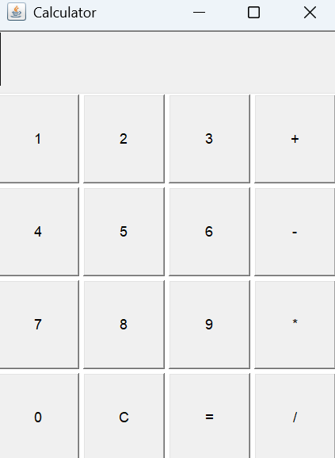

# Java AWT-Based Calculator

This is a simple calculator application built using Java AWT (Abstract Window Toolkit). It performs basic arithmetic operations like addition, subtraction, multiplication, and division.

## 🛠 Features

- GUI built using AWT
- Basic operations: `+`, `-`, `*`, `/`
- Clear (`C`) and Equals (`=`)
- Input through clickable buttons
- Error handling for division by zero

## 💻 Technologies Used

- Java
- AWT (Abstract Window Toolkit)
- Event Handling

## 📸 Screenshot


## 🧾 How to Run

1. Ensure you have Java installed.
2. Save the code in a file named `Calculator.java`.
3. Compile the file:
   ```bash
   javac Calculator.java
4. Run the compiled class:
   ```bash
   java Calculator


## 📃 License

This project is open source and available under the MIT License.
